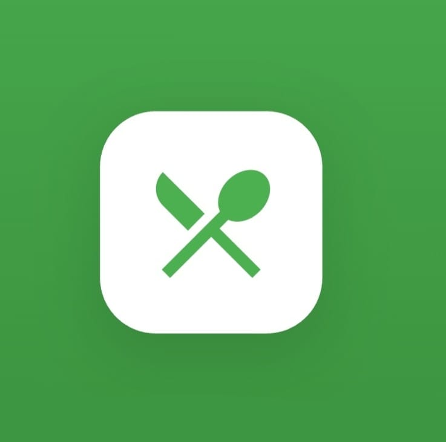

<div align="center">



# 🥗 Healthy Meals Delivery

### *Eat smart, live better — nutritious meals delivered to your door.*

[](https://flutter.dev)
[](https://dart.dev)
[](https://firebase.google.com)
[](https://developers.google.com)
[](https://flutter.dev)

</div>

---

## 📖 About

**Healthy Meals Delivery** is a cross-platform Flutter mobile application designed for health-conscious individuals who want convenient access to nutritious meals. Users can browse meal options with full nutritional breakdowns, place orders, track delivery in real time, and rate their experience — all in one clean, intuitive app.

Built as a graduation project at **Sadat Academy for Management and Sciences**, the app tackles the real-world problem of limited access to healthy food by connecting users with quality meal providers through a fast, Firebase-powered platform.

---

## 🚀 Key Features

- 🔐 **Secure Authentication** — Firebase Auth with email/password and Google Sign-In
- 🥘 **Meal Browsing** — Browse a wide variety of healthy meal options with search and filtering
- 🧪 **Nutritional Transparency** — Detailed breakdown of calories, macronutrients, and ingredients per meal
- 📋 **Personalized Meal Planning** — Schedule and manage weekly meal plans
- 🛒 **Order Placement** — Quick, seamless meal ordering with customization options
- 📍 **Real-Time Delivery Tracking** — Live order status updates from preparation to delivery
- 💳 **Secure Payments** — Integrated payment gateway for safe and convenient transactions
- ⭐ **Review & Rating System** — User feedback system to ensure meal quality consistency
- 🔔 **Push Notifications** — Order confirmations, delivery updates, and promotional offers via Firebase Cloud Messaging
- 🎠 **Interactive Carousels** — Featured meals and promotions displayed with smooth carousel sliders
- 📱 **Smooth Onboarding** — Page indicator-guided onboarding experience
- ✨ **Polished UI** — Google Fonts typography, Font Awesome icons, and SVG assets for a premium look
- 💾 **Persistent Sessions** — User preferences and session data stored with Shared Preferences

---

## 🛠️ Tech Stack

| Layer | Technology |
|---|---|
| **Framework** | Flutter 3.x / Dart 3.7.0 |
| **State Management** | Provider 6.x |
| **Authentication** | Firebase Auth + Google Sign-In |
| **Database** | Cloud Firestore (real-time NoSQL) |
| **Push Notifications** | Firebase Cloud Messaging (FCM) |
| **Local Storage** | Shared Preferences |
| **UI Components** | Carousel Slider, Smooth Page Indicator |
| **Icons & Fonts** | Google Fonts, Font Awesome Flutter |
| **Assets** | Flutter SVG Provider |
| **Design Tool** | Figma (UI/UX Prototyping) |
| **Version Control** | Git & GitHub |
| **App Icon** | Flutter Launcher Icons |

---

## 🏗️ Project Structure

```
meallplanning2/
├── lib/
│   ├── core/                      # App-wide utilities, constants & theme
│   │   ├── theme/                 # Color palette, text styles, Google Fonts
│   │   └── utils/                 # Helpers, validators, formatters
│   ├── data/                      # Data layer
│   │   ├── models/                # Meal, User, Order, Review models
│   │   └── repositories/          # Firestore data repositories
│   ├── providers/                 # Provider state management
│   │   ├── auth_provider.dart     # Firebase Auth state
│   │   ├── meal_provider.dart     # Meal browsing & filtering state
│   │   └── order_provider.dart    # Order & delivery tracking state
│   ├── screens/                   # Feature-based UI screens
│   │   ├── onboarding/            # Onboarding with smooth page indicator
│   │   ├── auth/                  # Sign Up & Login (email + Google)
│   │   ├── home/                  # Homepage with meal carousels
│   │   ├── meals/                 # Meal browsing, details & nutrition info
│   │   ├── order/                 # Order placement & customization
│   │   ├── tracking/              # Real-time delivery tracking
│   │   ├── reviews/               # Meal ratings & user reviews
│   │   ├── notifications/         # FCM notification center
│   │   └── profile/               # User profile & order history
│   ├── widgets/                   # Reusable UI components
│   │   ├── meal_card.dart         # Meal listing card with nutrition badge
│   │   ├── carousel_banner.dart   # Featured meals carousel
│   │   └── rating_bar.dart        # Star rating widget
│   └── main.dart                  # App entry point & Firebase init
├── assets/
│   └── icon/
│       └── icon.jpg               # App icon
├── pubspec.yaml
└── README.md
```

> 📌 The project follows a **feature-first layered architecture** with Provider state management, ensuring clean separation between data, business logic, and UI.

---

## ⚙️ Getting Started

### Prerequisites

- Flutter SDK `^3.7.0` — [Install Flutter](https://docs.flutter.dev/get-started/install)
- Dart SDK `^3.7.0`
- Android Studio / Xcode
- Firebase project with Auth, Firestore, and FCM enabled

### Installation

```bash
# 1. Clone the repository
git clone https://github.com/your-username/healthy-meals-delivery.git
cd meallplanning2

# 2. Install dependencies
flutter pub get

# 3. Configure Firebase
# - Place google-services.json in android/app/
# - Place GoogleService-Info.plist in ios/Runner/

# 4. Generate app icons
dart run flutter_launcher_icons

# 5. Run the app
flutter run
```

### Environment Configuration

```
android/app/google-services.json         ← Firebase Android config
ios/Runner/GoogleService-Info.plist      ← Firebase iOS config
```

---

## 🗃️ Database Design (ERD Summary)

| Entity | Key Attributes |
|---|---|
| **User** | userID (PK), fullName, email, password, phone, address |
| **Meal** | mealID (PK), name, description, calories, protein, carbs, fat, price, category |
| **Order** | orderID (PK), userID (FK), mealID (FK), quantity, status, date, totalPrice |
| **Review** | reviewID (PK), userID (FK), mealID (FK), rating, comment, date |
| **Notification** | notifID (PK), userID (FK), message, type, timestamp, isRead |

---


## 🔮 Future Roadmap

- 🤖 **AI Meal Recommendations** — Personalized suggestions based on dietary goals and history
- 🧬 **Allergy & Diet Filters** — Vegan, gluten-free, diabetic-friendly filters
- 📊 **Nutrition Dashboard** — Weekly calorie and macronutrient tracking charts
- 🌍 **Multi-Language Support** — Arabic and English interface
- 🎁 **Loyalty Rewards** — Points system for repeat orders and referrals
- 📴 **Offline Menu Browsing** — View meals without internet connection

---

<div align="center">
  <sub>Built with 💙 using Flutter · Powered by Firebase · Designed in Figma</sub><br/>
  <sub>⭐ Star this repo if you found it helpful!</sub>
</div>
